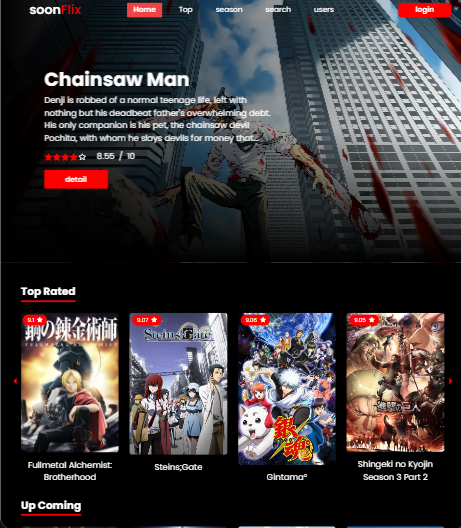

# soonFlix -- animeList app

# start

start download or clone my github

```txt
git clone https://github.com/ziss25/anime-Lists-app.git
```

then the [client](#) and [server](#) folders must have their dependencies installed

```txt
npm install
```

initialize [Environment Variables](#), see below :

```env
ORIGIN_DOMAIN_CLIENT =  // the client's domain URL
ACCESS_TOKEN_SECRET =  // random text ... asdsadawadasfafea
REFRESH_TOKEN_SECRET = // random text .... sadadawdwdadwa3fwqaqdq2eg
DB_NAME = // name from the mysql database
DB_USER = // user  from the mysql database
DB_PASS = // password name from the mysql database
DB_HOST = // host name from the mysql database
DB_PORT = // port from the mysql database

```

# demo

visit the demo website here:

```txt
https://animelist-ziss25.vercel.app
```

## resorces build

- [client](#overview)
  - [React](#the-challenge)
  - [MUI](#screenshot)
  - [axios](#links)
  - [jwt-decode](#links)
  - [React-router-dom](#links)
  - [Swiper JS](#links)
  - [daisy UI](#links)
  - [vite](#links)
  - [tailwind css](#links)
- [server](#my-process)
  - [axios](#built-with)
  - [bycript](#what-i-learned)
  - [dotenv](#what-i-learned)
  - [express](#what-i-learned)
  - [jsonWebToken](#what-i-learned)
  - [multer](#what-i-learned)
  - [mysql database](#what-i-learned)
  - [sequlize](#what-i-learned)
  - [cookie-parser](#)
  - [cors](#)

# preview



## Author

- website - [@ziss25](https://ziss25.github.io)
