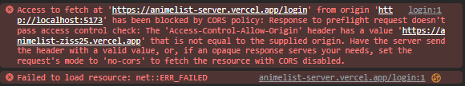

# soonFlix -- animeList app

visit the demo website here:

```txt
https://animelist-ziss25.vercel.app
```

# preview


# start

start download or clone my github

```txt
git clone https://github.com/ziss25/anime-Lists-app.git
```

then the [client](#) and [server](#) folders must have their dependencies installed

```txt
npm install
```

initialize [Environment Variables](#) in [server](#), see below :

```env
ORIGIN_DOMAIN_CLIENT =  // the client's domain URL
ACCESS_TOKEN_SECRET =  // random text ... example: aasdasafakklvqsdsadawadasfafea
REFRESH_TOKEN_SECRET = // random text ... example: sadadawdwdadwaakdah3fwqaqdq2eg
DB_NAME = // name from the mysql database
DB_USER = // user  from the mysql database
DB_PASS = // password name from the mysql database
DB_HOST = // host name from the mysql database
DB_PORT = // port from the mysql database

```

adjust the server url.. in the client/src/api/apiMyAnimeList in folder [client](#) and then edit it in the file :

```js
const urlServer = 'http://your-server'; // example
```

Just run the [client](#) and [server](#) , To run it, it's usually in each package... and congratulations 👋👋

# cors problem

If there is a Cors error like this, don't worry, try changing the env section then pushing it to GitHub



but if it doesn't work, just change it in the server/index.js file

```js
app.use(cors({ origin: 'http:url-client', credentials: true }));
```

# deploy

To deploy, for now you can use the following....and this can deploy clients and servers

- [netfly](#)
- [vercel](#)

## resorces build

- [client](#)
  - [React](#)
  - [MUI](#)
  - [axios](#)
  - [jwt-decode](#)
  - [React-router-dom](#)
  - [Swiper JS](#)
  - [daisy UI](#)
  - [vite](#)
  - [tailwind css](#)
- [server](#)
  - [axios](#)
  - [bycript](#)
  - [dotenv](#)
  - [express](#)
  - [jsonWebToken](#)
  - [multer](#)
  - [mysql database](#)
  - [sequlize](#)
  - [cookie-parser](#)
  - [cors](#)

## Author

- website - [@ziss25](https://ziss25.github.io)
